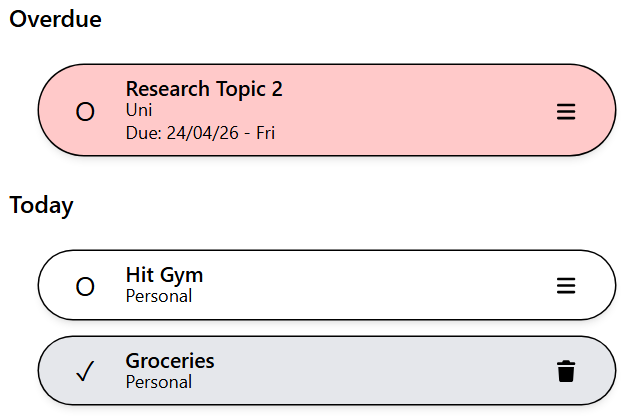

# Focusio

Focusio is a simple task management web app designed to keep things clear and easy to use. With simple design, it focuses on showing what actually matters - what’s overdue, what needs to be done today, and what’s coming up next.

The goal of this project is to build something that feels practical and realistic, not just another checklist app.

---

## Features

- Tasks are automatically grouped into:
  - Overdue
  - Today
  - Tomorrow
  - This Week (Monday to Sunday)

- Create, edit, and delete tasks

- Mark tasks as completed

- Filter tasks by status (all, ongoing, completed)

- Due dates are displayed with day labels (e.g. 24/04/26 - Fri)

- Data is stored locally in the browser

---

## Tech Stack

- React (Vite)
- TypeScript
- Tailwind CSS
- shadcn/ui

---

## Getting Started

Clone the repository and run it locally:

```bash
git clone https://github.com/timothieecantcode/focusio.git
cd focusio
npm install
npm run dev
```

---

## Current Limitations

- Data is stored locally (no backend yet)
- No authentication
- No syncing across devices

---

## Future Plans

- Add backend and database support
- User accounts and authentication
- Persistent storage across devices
- Notifications and reminders

---

## Notes

This project focuses more on usability and structure rather than complexity. The idea is to build something that feels close to a real product, while keeping the codebase clean and understandable.

---

## Screenshot


